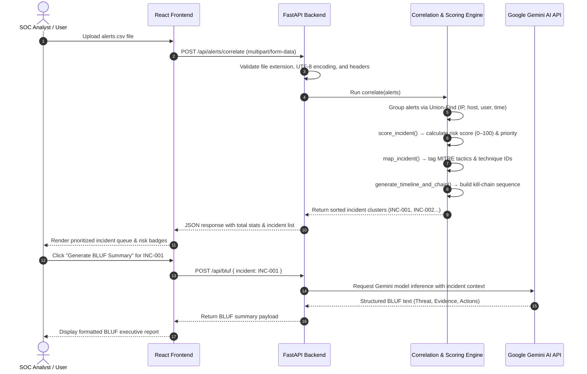

# System Architecture

## System Architecture

The **Threat Intelligence Correlation & Alert Prioritisation Assistant** uses a decoupled client-server architecture. The frontend is a modern React.js single-page application (SPA), and the backend is a lightweight, high-performance FastAPI service running Uvicorn.

```mermaid
graph TD
    A["User / SOC Analyst"] -->|"CSV Upload & UI Interaction"| B["React Frontend Dashboard (Port 3000)"]
    B -->|"REST API Calls (HTTP/CORS)"| C["FastAPI Backend Server (Port 8000)"]
    
    subgraph Backend Core Pipeline
        C -->|"Validate & Parse CSV"| D["CSV Parser (main.py)"]
        D -->|"Correlate Alerts"| E["Union-Find Engine (correlator.py)"]
        E -->|"Calculate 0-100 Score"| F["Risk Scorer (scorer.py)"]
        F -->|"Map TTPs & Techniques"| G["MITRE ATT&CK Mapper (mitre.py)"]
        G -->|"Build Timeline & Kill Chain"| H["Timeline Generator (timeline.py)"]
    end

    H -->|"Send Scored Incident"| I["BLUF Generator (bluf_generator.py)"]
    I -->|"GenAI API (google-genai)"| J["Google Gemini API (gemini-2.5-flash)"]
    I -.->"Rule-Based Fallback Summary (No Key / Offline)"| I
    J -->|"Generated BLUF Summary"| I
    I -->|"Return Incident Payload & BLUF"| B
```

## Components

| Component | Technology | File / Location | Responsibility |
|---|---|---|---|
| **Frontend Dashboard** | React.js (CSS3, SVG) | `src/frontend/src/App.js` | Interactive UI for CSV alert upload, incident list visualization, risk score badges, MITRE tag filters, timeline rendering, and BLUF report display. |
| **REST API Server** | FastAPI (Uvicorn) | `src/backend/main.py` | Exposes REST endpoints (`/api/status`, `/api/alerts/upload`, `/api/alerts/correlate`, `/api/bluf`), handles CORS, CSV parsing, file size limits (5 MB max), and route orchestration. |
| **Correlation Engine** | Python (Union-Find) | `src/backend/correlator.py` | Implements disjoint-set data structure with path compression to group alerts into incident clusters based on shared IPs, hostnames, usernames, and time proximity. |
| **Risk Scorer** | Python | `src/backend/scorer.py` | Calculates transparent 0–100 risk score based on severity base points, cluster size, regex attack indicator keywords, multi-source corroboration, and severity spread. |
| **MITRE ATT&CK Mapper** | Python | `src/backend/mitre.py` | Maps alert descriptions and indicators to MITRE ATT&CK tactics (e.g., Initial Access, Credential Access, Lateral Movement) and technique IDs (e.g., T1566.001, T1059.001, T1003.001). |
| **Timeline Generator** | Python | `src/backend/timeline.py` | Sorts alerts chronologically within an incident, builds step-by-step event timelines, and categorizes kill-chain progression stages. |
| **AI BLUF Generator** | Google GenAI SDK | `src/backend/bluf_generator.py` | Formulates AI prompts and calls Google Gemini API to produce structured executive BLUF summaries with key evidence, MITRE mappings, and actionable containment steps. Includes rule-based fallback logic. |

## Data Flow



## Security Considerations

- **API Key Confidentiality:** `GEMINI_API_KEY` is loaded strictly on the backend via `python-dotenv` from `.env`. It is never exposed to client-side frontend code or committed to Git (`.env` is listed in `.gitignore`).
- **Input Validation & File Limits:** The backend enforces strict CSV validation:
  - File extension check (`.csv` only).
  - Maximum upload file size cap (5 MB) to prevent Denial of Service (DoS) memory exhaustion.
  - Header column validation (`id`, `severity`, `source`, `description` mandatory).
- **CORS Configuration:** `CORSMiddleware` is configured on FastAPI to manage request origins cleanly.
- **Fail-Safe Fallbacks:** If the AI API fails (e.g. 401 unauthorized, 429 rate limit, 503 service overload), backend endpoints catch errors gracefully and return structured rule-based fallbacks instead of crashing or leaking stack traces.

## Scalability Notes

- **Stateless Backend Service:** The FastAPI backend holds no in-memory session state, allowing horizontal scaling behind load balancers (e.g., NGINX, AWS ALB, or Kubernetes Ingress).
- **Efficient Correlation Algorithm:** Union-Find operates with near-linear time complexity \(O(N \alpha(N))\), enabling fast processing of tens of thousands of alert rows in milliseconds.
- **Future Production Roadmap:**
  - Ingest live SIEM event streams (Apache Kafka / AWS Kinesis) in place of static CSV uploads.
  - Store historical incidents and telemetry in PostgreSQL / ElasticSearch with vector indexing for historical threat searching.
  - Add OAuth2 / OpenID Connect authentication for enterprise SOC multi-tenancy.

